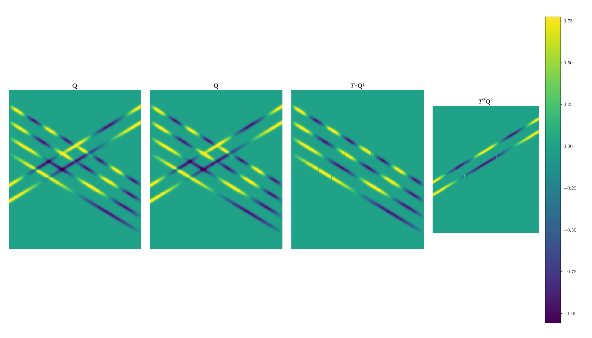

Getting started
===============

This page details how to run sPOD on a simple example.

We first load the needed modules:

.. code-block:: python

    import numpy as np
    import matplotlib.pyplot as plt
    from sPOD_algo import shifted_POD, sPOD_Param, give_interpolation_error
    from transforms import Transform

Then, we generate the data.
We start by declaring the variables we need:

.. code-block:: python

    Tmax = 0.5  # total time
    L = 1       # total domain size
    x = np.arange(0, Nx) / Nx * L
    t = np.arange(0, Nt) / Nt * Tmax
    dx = x[1] - x[0]
    dt = t[1] - t[0]
    [X, T] = np.meshgrid(x, t)
    X = X.T
    T = T.T
    c = dx / dt
    delta = 0.0125

Afterwards, we build the two frames and the snapshot matrix:
    
.. code-block:: python

    # First frame
    q1 = np.zeros_like(X)
    shifts1 = c * t
    for r in np.arange(1, 5):
        x1 = 0.5 + 0.1 * r - shifts1
        q1 = q1 + np.sin(2 * np.pi * r * T / Tmax) * np.exp(-((X - x1) ** 2) / delta**2)
    # Second frame
    shifts2 = -c * t
    q2 = np.zeros_like(X)
    for r in np.arange(1, 3):
        x2 = 0.2 + 0.1 * r - shifts2
        q2 = q2 + np.cos(2 * np.pi * r * T / Tmax) * np.exp(-((X - x2) ** 2) / delta**2)

    Q = q1 + q2  # Snapshot matrix
    nmodes = [4, 2]
    shift_list = [shifts1, shifts2]

We now define the transforms corresponding to the shift operators in our data
generation:

.. code-block:: python
      
    data_shape = [Nx, 1, 1, Nt]
    transfos = [
        Transform(data_shape, [L], shifts=shift_list[0], dx=[dx], interp_order=5),
        Transform(data_shape, [L], shifts=shift_list[1], dx=[dx], interp_order=5)]

We can compute and show the interpolation error caused by the transforms:

.. code-block:: python

    interp_err = np.max([give_interpolation_error(Q, transfo) for transfo in transfos])
    print("Interpolation error: {:1.2e}".format(interp_err))
   

We are now read to call one of the proximal algorithms to separate the co-moving
frames.
In the snippet below, we use the Augmented Lagrangian Method (ALM).

.. code-block:: python

    # Define the algorithm parameters
    qmat = np.reshape(Q, [Nx, Nt])
    param_alm = Nx * Nt / (4 * np.sum(np.abs(qmat)))
    myparams = sPOD_Param()
    myparams.maxit = Niter
    # Apply ALM method
    method = "ALM"
    ret = shifted_POD(qmat, transfos, nmodes, myparams, METHOD, param_alm)
    sPOD_frames, qtilde, rel_err = ret.frames, ret.data_approx, ret.rel_err_hist
    qf = [
        np.squeeze(np.reshape(transfo.apply(frame.build_field()), data_shape))
        for transfo, frame in zip(transfos, ret.frames)
    ]

Finally, we visualize the results using matplotlib

.. code-block:: python
                
    # First we plot the resulting field
    gridspec = {"width_ratios": [1, 1, 1, 1]}
    fig, ax = plt.subplots(1, 4, figsize=(12, 4), gridspec_kw=gridspec, num=101)
    mycmap = "viridis"
    vmin = np.min(qtilde) * 0.6
    vmax = np.max(qtilde) * 0.6

    ax[0].pcolormesh(qmat, vmin=vmin, vmax=vmax, cmap=mycmap)
    ax[0].set_title(r"$\mathbf{Q}$")
    ax[0].axis("off")

    ax[1].pcolormesh(qtilde, vmin=vmin, vmax=vmax, cmap=mycmap)
    ax[1].set_title(r"$\tilde{\mathbf{Q}}$")
    ax[1].axis("off")
    # The result is a list of the decomposed field.
    # Each element of the list contains a frame of the decomposition.
    # 1. frame
    k_frame = 0
    ax[2].pcolormesh(qf[k_frame], vmin=vmin, vmax=vmax, cmap=mycmap)
    ax[2].set_title(r"$T^" + str(k_frame + 1) + "\mathbf{Q}^" + str(k_frame + 1) + "$")
    ax[2].axis("off")
    # 2. frame
    k_frame = 1
    im2 = ax[3].pcolormesh(qf[k_frame], vmin=vmin, vmax=vmax, cmap=mycmap)
    ax[3].set_title(r"$T^" + str(k_frame + 1) + "\mathbf{Q}^" + str(k_frame + 1) + "$")
    ax[3].axis("off")

    for axes in ax[:4]:
        axes.set_aspect(0.6)

    plt.colorbar(im2)
    plt.show()

This code snippet results into the following figure.
We observe the strict separation of the two co-moving fields.

